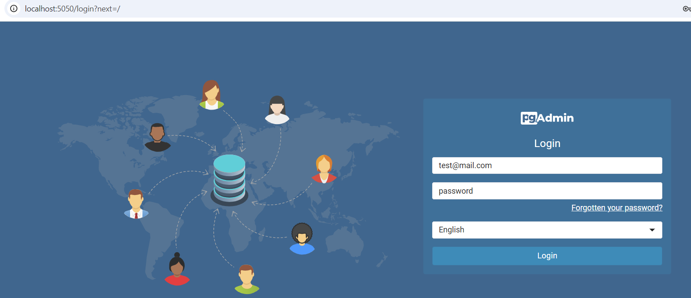
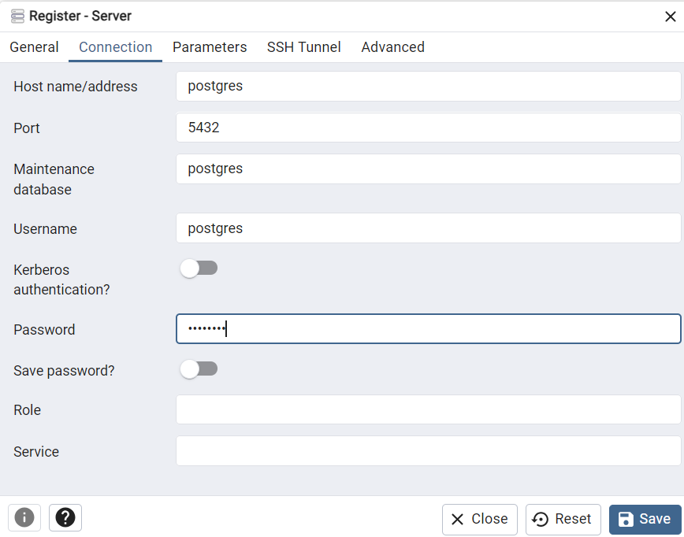
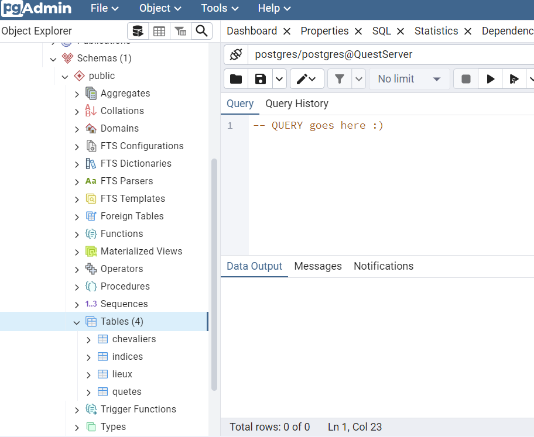

# PostgreSQL / PgAdmin Docker compose example
Ceci est un exemple de fichier docker-compose pour démarrer un container PostgreSQL, un container PgAdmin4 et avoir les deux qui communiquent à travers un bridge network

## Prérequis
- [Docker](https://www.docker.com/)

## Utilisation
1. Démarrer le service Docker sur la machine (docker desktop sur windows)
2. Démarrer les containers postgres et pgAdmin : `docker-compose up -d`
3. Accéder à pgAdmin &rarr; http://localhost:5050/
   

4. Add New Server &rarr; renseigner un nom de serveur et les infos suivantes (`changeme` pour le password):

5. Utiliser le Query tool pgAdmin pour créer ses tables et exécuter des requêtes

